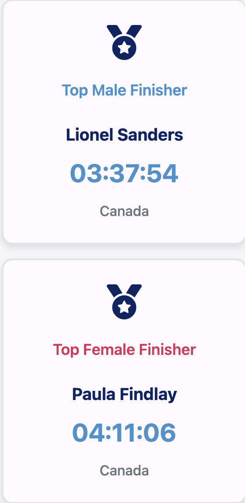
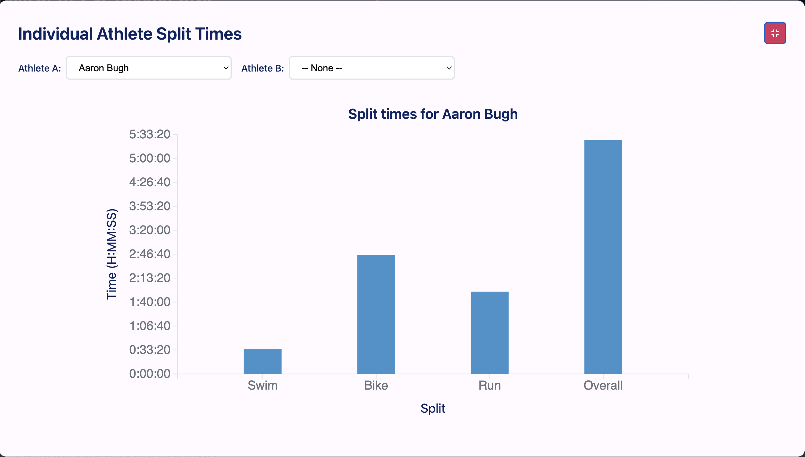
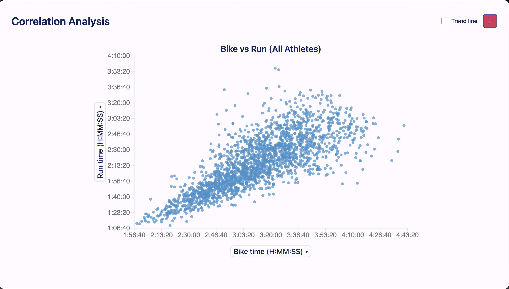
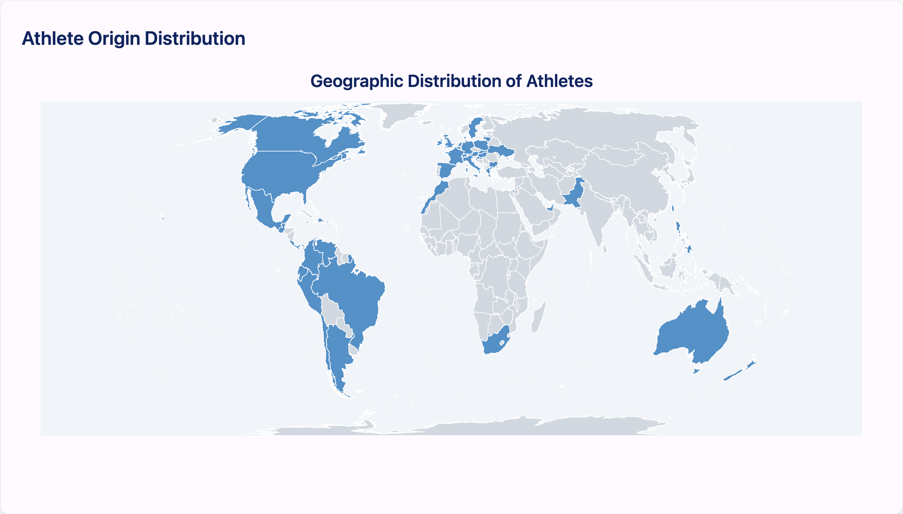
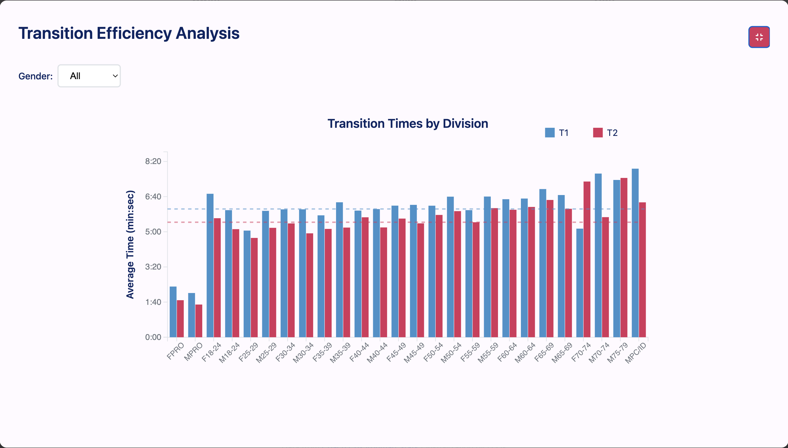
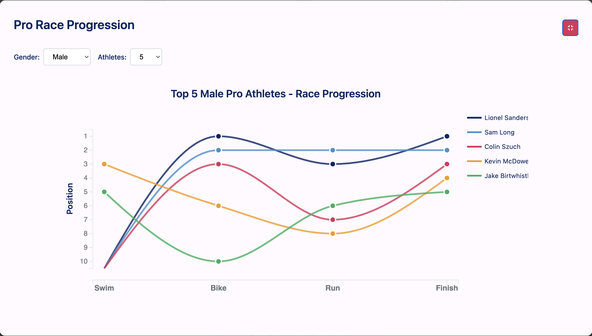

# Ironman - Performance Dashboard

## Link:

https://gabrielpuente58.github.io/ironman-performance-dashboard/

## Description

The Ironman Performance Dashboard is an interactive data visualization tool designed to analyze and compare athlete performance across multiple Ironman and Ironman 70.3 races.
Built with D3.js, this dashboard provides insights into race results, split times, athlete demographics, and performance correlations.
Users can explore data from various races, compare athletes, identify performance patterns, and even predict finish times based on split inputs.

## Datasets

### Link to dataset source:

https://www.coachcox.co.uk/imstats/im/

### Ironman 140.6 (Full Ironman)

- **Swim**: 3.86 km (2.4 miles)
- **Bike**: 180.25 km (112 miles)
- **Run**: 42.20 km (26.2 miles)
- **Total**: 226.31 km (140.6 miles)

Available races:

- **Ironman Lake Placid 2024** (`full-ironmans/ironmanlakeplacid2024_clean.csv`)
- **Ironman Texas 2025** (`full-ironmans/ironmantexas2025_clean.csv`)
- **Ironman World Championship Kona Women 2024** (`full-ironmans/ironmanworldchampionshipkonawomen2024_clean.csv`) - Female only
- **Ironman World Championship Nice Men 2024** (`full-ironmans/ironmanworldchampionshipnicemen2024_clean.csv`) - Male only

### Ironman 70.3 (Half Ironman)

- **Swim**: 1.93 km (1.2 miles)
- **Bike**: 90.12 km (56 miles)
- **Run**: 21.10 km (13.1 miles)
- **Total**: 113.15 km (70.3 miles)

Available races:

- **Ironman 70.3 St. George 2025** (`half-ironmans/ironman70.3st.george2025_clean.csv`)
- **Ironman 70.3 Oceanside 2025** (`half-ironmans/ironman70.3oceanside2025_clean.csv`)
- **Ironman 70.3 World Championship Men 2024** (`half-ironmans/ironman70.3worldchampionshipmen2024_clean.csv`) - Male only
- **Ironman 70.3 World Championship Women 2024** (`half-ironmans/ironman70.3worldchampionshipwomen2024_clean.csv`) - Female only

## Screenshots

### Top Finisher Cards

### Chart 1: Individual Athlete Split Times / Athlete Comparison

### Chart 2: Performance Correlation Analysis

### Chart 3: Athlete Origin Distribution

### Chart 4: Split Time Distribution

### Race Finish Time Predictor

### Chart 5: Transition Efficiency Analysis

### Chart 6: Pro Race Progression

